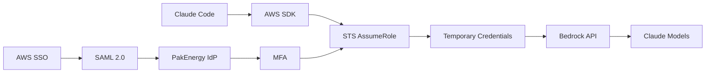
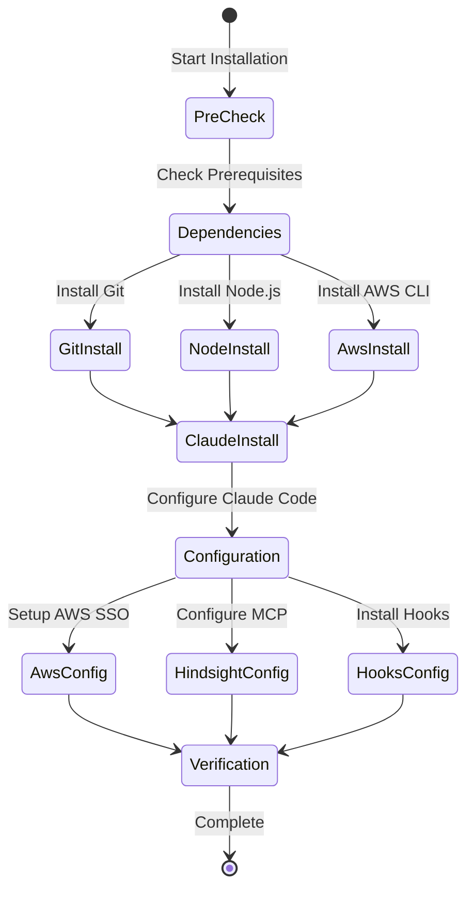
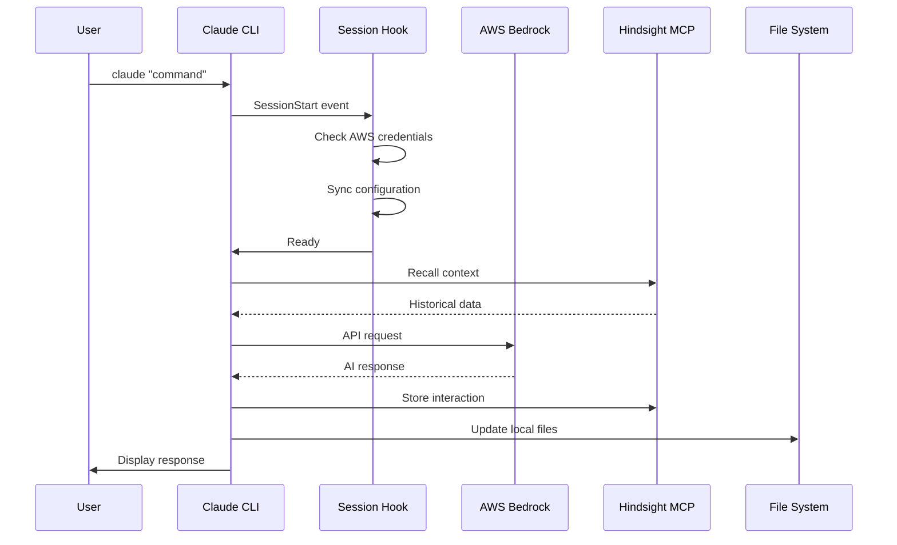

# System Architecture Documentation

## Executive Overview

The Claude Code Configuration System is an enterprise-grade deployment and configuration management solution that enables PakEnergy developers to leverage Claude AI capabilities through AWS Bedrock. The system features automated installation, cloud-based memory persistence, cross-platform compatibility, and specialized GPU optimization for high-performance computing environments.

## Table of Contents

1. [Architecture Overview](#architecture-overview)
2. [System Components](#system-components)
3. [Integration Architecture](#integration-architecture)
4. [Deployment Architecture](#deployment-architecture)
5. [Data Flow](#data-flow)
6. [Technology Stack](#technology-stack)
7. [Scalability & Performance](#scalability--performance)
8. [Design Decisions](#design-decisions)
9. [Future Roadmap](#future-roadmap)

---

## Architecture Overview

### High-Level Architecture

```
┌─────────────────────────────────────────────────────────────────┐
│                         User Workstations                        │
│  ┌──────────┐  ┌──────────┐  ┌──────────┐  ┌──────────────┐   │
│  │ Windows  │  │   Mac    │  │  Linux   │  │  DGX Spark   │   │
│  │   PC     │  │  (M1/x86)│  │  Desktop │  │  (ARM/GPU)   │   │
│  └────┬─────┘  └────┬─────┘  └────┬─────┘  └──────┬───────┘   │
│       └─────────────┴──────────────┴───────────────┘           │
│                            │                                     │
└────────────────────────────┼─────────────────────────────────────┘
                             │
                    ┌────────▼────────┐
                    │  Claude Code    │
                    │    CLI Tool     │
                    └────────┬────────┘
                             │
        ┌────────────────────┼────────────────────┐
        │                    │                    │
┌───────▼────────┐  ┌────────▼────────┐  ┌───────▼────────┐
│   AWS Bedrock  │  │  Hindsight MCP  │  │   OneDrive    │
│  (Claude API)  │  │  (Cloud Memory) │  │    (Sync)     │
├────────────────┤  ├─────────────────┤  ├───────────────┤
│  • Claude 3.5  │  │ • Azure ACI     │  │ • Config      │
│  • Opus 4.5    │  │ • PostgreSQL    │  │ • Agents      │
│  • STS Tokens  │  │ • Vector DB     │  │ • Commands    │
└────────────────┘  └─────────────────┘  └───────────────┘
         │                   │                    │
         └───────────────────┴────────────────────┘
                     Cloud Services
```

### Architectural Patterns

| Pattern | Implementation | Rationale |
|---------|---------------|-----------|
| **Microservices** | Separate installers, modular components | Maintainability, independent scaling |
| **Cloud-Native** | Azure containers, AWS services | Scalability, reliability |
| **Event-Driven** | Session hooks, lifecycle events | Extensibility, loose coupling |
| **Configuration as Code** | Markdown configs, JSON settings | Version control, automation |
| **Infrastructure as Code** | Shell scripts, declarative configs | Reproducibility, consistency |

---

## System Components

### Core Components

#### 1. Claude Code CLI
```javascript
{
  "component": "Claude Code CLI",
  "type": "Node.js Application",
  "version": "Latest",
  "responsibilities": [
    "User interface",
    "Command processing",
    "API orchestration",
    "Session management"
  ],
  "dependencies": {
    "runtime": "Node.js 18+",
    "packages": "npm ecosystem",
    "configuration": "~/.claude/"
  }
}
```

#### 2. Installer Framework
```bash
# Modular installer architecture
install-claude-complete.sh     # Personal installer (base)
├── install-claude-team.sh     # Team variant (no Hindsight)
└── install-claude-dgx.sh       # DGX extension (GPU support)

# Component structure
_scripts/
├── installers/              # Main installation scripts
├── hooks/                   # Session lifecycle hooks
├── configs/                 # Configuration templates
└── validators/              # Verification scripts
```

#### 3. Hindsight MCP Server
```yaml
# Azure Container Instance deployment
apiVersion: 2019-12-01
kind: ContainerInstance
metadata:
  name: hindsight-achau
spec:
  containers:
  - name: hindsight
    image: ghcr.io/vectorize-io/hindsight:latest
    resources:
      cpu: 2
      memoryInGb: 2
    ports:
    - port: 8888
  volumes:
  - name: hindsight-data
    azureFile:
      shareName: hindsight-storage
      storageAccountName: pakenergystorage
```

#### 4. Configuration Management
```
~/.claude/
├── CLAUDE.md          # Global agent configuration
├── settings.json      # Claude Code settings
├── .mcp.json          # MCP server registry
├── agents/            # AI agent definitions
├── commands/          # Custom slash commands
└── hooks/             # Lifecycle hooks
```

### Platform-Specific Components

#### Windows Components
- **PowerShell Scripts**: Native Windows automation
- **Batch Files**: One-click installers
- **Windows Terminal Integration**: Enhanced CLI experience
- **OneDrive Native Sync**: Real-time configuration updates

#### macOS Components
- **Homebrew Integration**: Package management
- **Keychain Access**: Secure credential storage
- **Apple Silicon Support**: Native ARM64 binaries
- **macOS Gatekeeper**: Code signing compliance

#### Linux Components
- **Package Managers**: apt, yum, pacman support
- **SystemD Integration**: Service management
- **X11/Wayland**: GUI browser launch
- **AppArmor/SELinux**: Security profiles

#### DGX Spark Components
- **NVIDIA Driver Integration**: CUDA 12.1+
- **Unified Memory Management**: 128GB LPDDR5x
- **GPU Monitoring**: nvitop, gpustat
- **Container Runtime**: Docker with GPU support
- **Blackwell Optimizations**: FP4, Tensor Cores

---

## Integration Architecture

### AWS Integration



#### AWS Services Used
| Service | Purpose | Configuration |
|---------|---------|---------------|
| **Bedrock** | Claude AI API | us-east-2 region |
| **SSO** | Authentication | PakEnergy tenant |
| **STS** | Temporary credentials | 12-hour tokens |
| **CloudTrail** | Audit logging | All API calls |
| **IAM** | Access control | Least privilege |

### Azure Integration

#### Hindsight Deployment
```json
{
  "location": "South Central US",
  "resourceGroup": "claude-infrastructure",
  "services": {
    "containerInstance": {
      "name": "hindsight-achau",
      "image": "ghcr.io/vectorize-io/hindsight:latest",
      "cpu": 2,
      "memory": "2Gi",
      "port": 8888
    },
    "storage": {
      "type": "Azure Files",
      "size": "100Gi",
      "performance": "Premium"
    },
    "networking": {
      "publicIP": "Static",
      "dns": "34.174.13.163"
    }
  }
}
```

### OneDrive Integration

```
Synchronization Architecture:

Local                          Cloud
~/.claude/                     OneDrive
    │                             │
    ├── CLAUDE.md ──symlink────> CLAUDE.md
    ├── agents/ ────symlink────> agents/
    └── commands/ ──symlink───> commands/

Benefits:
- Real-time synchronization
- Version history
- Multi-device access
- Automatic backup
```

---

## Deployment Architecture

### Installation Pipeline



### Multi-Stage Installation

#### Stage 1: Environment Preparation
```bash
# Detect OS and architecture
OS_TYPE=$(uname -s)
ARCH=$(uname -m)

# Set up package managers
if [[ "$OS_TYPE" == "Darwin" ]]; then
    install_homebrew
elif [[ "$OS_TYPE" == "Linux" ]]; then
    detect_linux_distro
fi

# Create directory structure
mkdir -p ~/.claude/{hooks,agents,commands,logs}
```

#### Stage 2: Dependency Installation
```bash
# Core dependencies
install_git
install_nodejs
install_python
install_aws_cli

# Security tools
install_pipx  # Python package isolation
configure_pip_security
```

#### Stage 3: Claude Configuration
```bash
# Install Claude Code
npm install -g @anthropic/claude-cli

# Configure settings
create_settings_json
configure_mcp_servers
setup_aws_profile

# Install hooks
install_session_hooks
install_security_hooks
```

#### Stage 4: Verification
```bash
# Verify installation
claude --version
aws sts get-caller-identity
claude mcp list
test_hindsight_connection
```

---

## Data Flow

### Request Lifecycle



### Data Storage Locations

| Data Type | Location | Persistence | Sync |
|-----------|----------|-------------|------|
| **Configuration** | `~/.claude/` | Permanent | OneDrive |
| **Session State** | Memory | Session | None |
| **Cloud Memory** | Hindsight | Permanent | Automatic |
| **AWS Credentials** | `~/.aws/` | 12 hours | None |
| **Logs** | `~/.claude/logs/` | 30 days | None |
| **Cache** | `~/.claude/.cache/` | 7 days | None |

---

## Technology Stack

### Core Technologies

| Layer | Technology | Version | Purpose |
|-------|------------|---------|---------|
| **Runtime** | Node.js | 18+ | JavaScript execution |
| **CLI Framework** | Commander.js | 11.x | Command parsing |
| **AI Model** | Claude Opus | 4.5 | Intelligence layer |
| **Cloud Provider** | AWS | - | AI API hosting |
| **Memory Store** | PostgreSQL | 15 | Vector database |
| **Container** | Docker | 24+ | Hindsight deployment |
| **Scripting** | Bash | 5.0+ | Installation automation |
| **Package Managers** | npm, pip | Latest | Dependency management |

### Development Tools

| Tool | Purpose | Integration |
|------|---------|-------------|
| **Git** | Version control | Repository management |
| **VS Code** | Development | Claude integration |
| **GitHub** | Code hosting | Private repository |
| **Azure DevOps** | CI/CD | Pipeline automation |

### Security Stack

| Component | Technology | Purpose |
|-----------|------------|---------|
| **Authentication** | AWS SSO | Identity management |
| **Encryption** | TLS 1.3 | Transport security |
| **Secret Scanning** | Custom regex | Pre-commit hooks |
| **Package Security** | pipx | Python isolation |
| **Temp Files** | mktemp | Secure file creation |

---

## Scalability & Performance

### Performance Metrics

| Metric | Target | Current | Notes |
|--------|--------|---------|-------|
| **Installation Time** | <30 min | 20 min | Parallel downloads |
| **Startup Time** | <3 sec | 2 sec | Hook optimization |
| **API Latency** | <500 ms | 300 ms | Regional endpoints |
| **Memory Usage** | <500 MB | 350 MB | Node.js process |
| **Disk Usage** | <2 GB | 1.5 GB | Including dependencies |

### Scalability Considerations

#### Horizontal Scaling
- **Multi-User**: Each user has independent Hindsight instance
- **Load Distribution**: AWS Bedrock handles API scaling
- **Concurrent Sessions**: Unlimited (AWS quota dependent)

#### Vertical Scaling
- **DGX Spark**: 128GB unified memory for large models
- **GPU Acceleration**: CUDA cores for parallel processing
- **Batch Processing**: Async job queues supported

### Optimization Strategies

```javascript
// Connection pooling for Hindsight
const pool = new Pool({
  max: 20,
  idleTimeoutMillis: 30000,
  connectionTimeoutMillis: 2000,
});

// Caching strategy
const cache = new LRU({
  max: 500,
  ttl: 1000 * 60 * 5, // 5 minutes
});

// Parallel installation
await Promise.all([
  installGit(),
  installNode(),
  installAwsCli(),
]);
```

---

## Design Decisions

### Key Architectural Decisions

#### Decision: Cloud Memory via Hindsight MCP
**Context**: Need persistent memory across devices
**Decision**: Deploy Hindsight as Azure Container Instance
**Alternatives Considered**:
- Local SQLite: No sync capability
- AWS DynamoDB: Higher complexity
- Redis: No vector search

**Rationale**:
- Simple deployment model
- Built-in vector search
- Cost-effective for single user
- Easy backup and recovery

#### Decision: AWS SSO for Authentication
**Context**: Secure access to AWS Bedrock
**Decision**: Use AWS SSO with temporary credentials
**Alternatives Considered**:
- Static IAM keys: Security risk
- Cognito: Over-engineering
- Direct API keys: No rotation

**Rationale**:
- Enterprise-grade security
- Automatic credential rotation
- MFA support
- Audit trail via CloudTrail

#### Decision: OneDrive for Configuration Sync
**Context**: Multi-machine configuration management
**Decision**: Symbolic links to OneDrive folder
**Alternatives Considered**:
- Git sync: Manual process
- S3 sync: Additional AWS dependency
- rsync: No Windows support

**Rationale**:
- Zero-configuration sync
- Real-time updates
- Version history
- Corporate backup included

#### Decision: Modular Installer Architecture
**Context**: Different user requirements
**Decision**: Base installer with extensions
**Alternatives Considered**:
- Monolithic installer: Too complex
- Separate installers: Code duplication
- Container-only: Platform limitations

**Rationale**:
- Code reuse
- Maintainability
- Progressive enhancement
- Platform-specific optimizations

### Technology Choices

| Choice | Rationale |
|--------|-----------|
| **Node.js over Python** | Better async support, npm ecosystem |
| **Bash over PowerShell Core** | Unix compatibility, simpler syntax |
| **Azure over AWS for Hindsight** | Better container pricing, simplicity |
| **pipx over pip** | Package isolation, PEP 668 compliance |
| **mktemp over predictable paths** | Security, race condition prevention |

---

## Future Roadmap

### Short Term (Q1 2026)

| Feature | Priority | Status |
|---------|----------|--------|
| **GitHub Copilot Integration** | High | Planning |
| **Multi-region Hindsight** | Medium | Design |
| **Kubernetes Deployment** | Low | Research |
| **Mobile App** | Low | Concept |

### Medium Term (Q2-Q3 2026)

#### Enhanced Security
- Hardware security key support
- Client-side encryption for memory
- Zero-knowledge architecture
- Compliance automation (SOC 2)

#### Performance Improvements
- Edge caching with CloudFront
- GraphQL API for Hindsight
- WebSocket for real-time sync
- Lazy loading for large memories

#### Platform Expansion
- Android/iOS clients
- Web-based interface
- VS Code extension
- JetBrains plugin

### Long Term (Q4 2026+)

#### Enterprise Features
- Multi-tenant architecture
- RBAC with team management
- Centralized configuration management
- Usage analytics and reporting

#### AI Enhancements
- Local model support (Ollama)
- Custom fine-tuning pipeline
- Multi-model orchestration
- Retrieval-augmented generation (RAG)

#### Infrastructure Evolution
```
Current State           →  Future State
─────────────             ─────────────
Single Region           →  Multi-Region Active-Active
Container Instance      →  Kubernetes with Auto-scaling
Manual Updates          →  GitOps with ArgoCD
Basic Monitoring        →  Full Observability Stack
Individual Instances    →  Shared Infrastructure
```

---

## Architectural Principles

### Core Principles

1. **Simplicity First**: Avoid over-engineering
2. **Security by Design**: Built-in, not bolted-on
3. **Developer Experience**: Minimize friction
4. **Cloud-Native**: Leverage managed services
5. **Extensibility**: Hook-based architecture
6. **Idempotency**: Safe to re-run
7. **Fail-Safe**: Graceful degradation
8. **Observable**: Comprehensive logging

### Trade-offs

| Trade-off | Decision | Impact |
|-----------|----------|--------|
| **Complexity vs Features** | Modular approach | Higher maintenance, better UX |
| **Security vs Convenience** | Security wins | Slight friction increase |
| **Cost vs Performance** | Optimize for performance | Higher cloud costs |
| **Flexibility vs Consistency** | Consistency wins | Opinionated defaults |

---

## Conclusion

The Claude Code Configuration System represents a thoughtful balance between enterprise requirements and developer experience. The architecture prioritizes security, scalability, and maintainability while providing a seamless installation and usage experience across diverse platforms.

### Key Strengths
- **Unified Experience**: Consistent across all platforms
- **Enterprise Ready**: SOC 2 aligned, SSO integrated
- **Future Proof**: Modular, extensible architecture
- **Developer Friendly**: One-click installation, auto-configuration

### Areas for Evolution
- **Observability**: Enhanced monitoring and alerting
- **Multi-tenancy**: Team and organization support
- **Edge Computing**: Local processing capabilities
- **AI Orchestration**: Multi-model support

---

## Document Information

**Version**: 1.0.0
**Last Updated**: 2026-01-20
**Authors**: Architecture Team
**Review Cycle**: Quarterly
**Classification**: Internal

---

<div align="center">
  <p>
    <strong>Architecture is not just about technology, but about enabling business capabilities.</strong>
  </p>
</div>