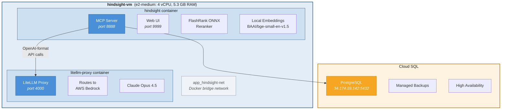
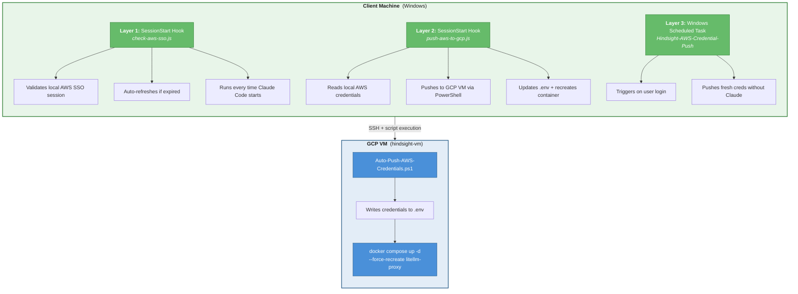
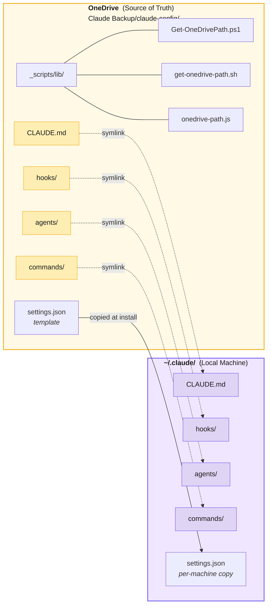
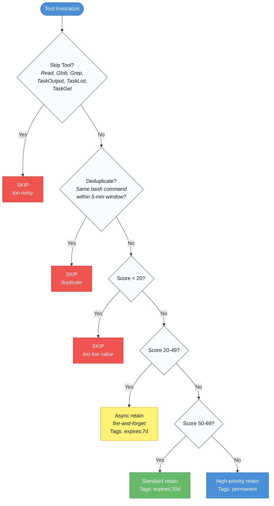

# Introduction & Motivation

## The Problem

Claude Code is a powerful CLI for software engineering, but it has no memory between sessions. Every new session starts from zero — no recall of previous decisions, no awareness of past debugging insights, no accumulated project knowledge. For teams and individuals working on long-running projects, this means:

- Repeating context setup every session
- Re-explaining architectural decisions
- Losing debugging insights that took hours to discover
- No continuity across machines (laptop, desktop, remote server)

## The Solution: Hindsight

[Hindsight](https://github.com/vectorize-io/hindsight) by Vectorize.io is an open-source persistent memory system that integrates with Claude Code via the Model Context Protocol (MCP). It provides three core operations:

- **`retain()`** — Store a fact, decision, or insight
- **`recall()`** — Search stored memories using semantic similarity
- **`reflect()`** — Synthesize insights from multiple memories using LLM reasoning

## What We Built

Starting from stock Hindsight, we built a production-grade deployment that includes:

- Cloud-hosted PostgreSQL replacing SQLite for durability
- LiteLLM proxy routing LLM calls through AWS Bedrock
- 6.8x faster reranking via FlashRank ONNX optimization
- Automated AWS credential pipeline (SSO tokens to GCP)
- Multi-machine config sync via OneDrive with auto-detection
- Intelligent auto-capture hooks with importance scoring

# Starting Point: Stock Hindsight

## Source

- **GitHub**: https://github.com/vectorize-io/hindsight
- **License**: Open-source
- **Architecture**: Python application with MCP server interface

## What Stock Hindsight Provides

| Component | Default Configuration |
|-----------|----------------------|
| **Storage** | SQLite (local file) |
| **Embeddings** | Configurable (various providers) |
| **Reranker** | SentenceTransformers with ms-marco-MiniLM-L-6-v2 |
| **LLM** | Direct OpenAI API |
| **MCP Tools** | retain, recall, reflect, list_banks, create_bank |
| **Deployment** | Docker container (single) |

## Stock Limitations for Our Use Case

1. **SQLite** — No concurrent access, no durability guarantees, lost if container rebuilds
2. **Direct OpenAI** — Organization requires AWS Bedrock for compliance and audit trail
3. **SentenceTransformers** — PyTorch-based reranker is slow on CPU (23+ seconds for 300 candidates)
4. **Single machine** — No built-in multi-machine support

# GCP Deployment Architecture

## Infrastructure Overview



## Component Details

| Component | Specification |
|-----------|--------------|
| **VM** | `hindsight-vm` — e2-medium (4 vCPU, 5.3 GB RAM) |
| **OS** | Container-Optimized OS / Debian |
| **Containers** | 2: `hindsight` + `litellm-proxy` |
| **Network** | `app_hindsight-net` (explicit Docker bridge) |
| **Database** | Cloud SQL PostgreSQL at `34.174.59.142:5432` |
| **Firewall** | Ports 8888 (API), 9999 (Web UI), 22 (SSH) |
| **Docker Compose** | `/home/achau/docker-compose.yml` |

## Why e2-medium?

The FlashRank ONNX reranker and local embeddings are CPU-bound. The e2-medium provides sufficient compute for our workload (single-user, ~50 queries/day) while keeping costs minimal. The 5.3 GB RAM accommodates both containers plus the reranker model in memory.

# Key Customizations (What We Changed vs Stock)

| Category | Stock Hindsight | Our Configuration | Why |
|----------|----------------|-------------------|-----|
| **Database** | SQLite (local) | Cloud SQL PostgreSQL | Durability, concurrent access, production-grade |
| **LLM Provider** | Direct OpenAI | LiteLLM Proxy to AWS Bedrock | Org compliance, SSO auth, Claude Opus 4.5 |
| **Reranker Engine** | SentenceTransformers (PyTorch) | FlashRank (ONNX Runtime) | 6.8x faster on CPU, 80% less RAM |
| **Reranker Model** | ms-marco-MiniLM-L-6-v2 | ms-marco-TinyBERT-L-2-v2 | Fastest model, 4 MB vs 22 MB |
| **Embeddings** | Configurable | Local BAAI/bge-small-en-v1.5 | Fast, self-contained, no external API calls |
| **Reranker Loading** | Eager (on startup) | Lazy (`LAZY_RERANKER=true`) | Faster container startup |

## Database: SQLite to Cloud SQL PostgreSQL

**Problem**: SQLite stores data in a local file inside the Docker container. Container rebuilds lose all memories. No concurrent access support.

**Solution**: Cloud SQL PostgreSQL instance provides:

- Automatic backups and point-in-time recovery
- Persistent storage independent of container lifecycle
- Support for concurrent connections
- Managed patching and maintenance

## LLM Provider: OpenAI to AWS Bedrock via LiteLLM

**Problem**: Direct OpenAI API calls require routing through AWS Bedrock for centralized access control. The organization uses AWS with SSO authentication.

**Solution**: A LiteLLM proxy container sits alongside Hindsight and translates OpenAI-format API calls into AWS Bedrock calls:

```
Hindsight → OpenAI-format request → LiteLLM Proxy → AWS Bedrock (Claude Opus 4.5)
```

LiteLLM presents an OpenAI-compatible API to Hindsight, so no code changes are needed in Hindsight itself. The proxy reads AWS credentials from environment variables, which are pushed from client machines via the credential pipeline (Section 6).

## Reranker: SentenceTransformers to FlashRank

**Problem**: The default SentenceTransformers reranker uses PyTorch for inference. On CPU-only VMs, reranking 300 candidates takes ~24 seconds — making `recall()` calls painfully slow.

**Solution**: FlashRank uses ONNX Runtime instead of PyTorch:

- ONNX Runtime is optimized for CPU inference
- No PyTorch dependency (large library eliminated)
- The TinyBERT-L-2 model (4 MB) loads in milliseconds
- Reranking 300 candidates: 3.5 seconds (down from 24)

**Configuration**:

```
RERANKER_TYPE=flashrank
FLASHRANK_MODEL=ms-marco-TinyBERT-L-2-v2
LAZY_RERANKER=true
```

## Embeddings: Local BAAI/bge-small-en-v1.5

All embeddings are computed locally using the BAAI/bge-small-en-v1.5 model:

- 384-dimensional vectors
- Runs on CPU with no external API calls
- Model loads once, stays in memory
- No network latency for embedding operations

# Performance Results

## Reranking Benchmark

| Metric | Before (SentenceTransformers) | After (FlashRank) | Improvement |
|--------|-------------------------------|-------------------|-------------|
| Reranking 300 candidates | 23.959s | 3.535s | **6.8x faster** |
| Total `recall()` latency | 24.3s | 5.7s | **4.2x faster** |
| `reflect()` (3 iterations) | ~78s | ~18s | **4.3x faster** |
| Cold start (first query) | N/A | 3.5s | One-time cost |

## Operational Metrics

| Metric | Value |
|--------|-------|
| Total memories stored | 7,273+ |
| Knowledge graph links | 738,808 |
| Named entities tracked | 8,066 |
| Average `recall()` (warm) | ~5.7s |
| Average `retain()` | ~200ms |
| Container memory usage | ~1.2 GB (both containers) |
| Uptime | 99.9%+ (GCP managed) |

## Why Cold Start Matters

The first query after container restart takes ~3.5 seconds because FlashRank loads the ONNX model lazily. All subsequent queries skip this step. With `LAZY_RERANKER=true`, container startup is fast, and the one-time model load penalty is absorbed by the first real query.

# AWS Credential Pipeline

## The Problem

Hindsight runs on GCP but needs AWS Bedrock credentials for LLM calls (via LiteLLM). AWS SSO tokens expire every 12 hours. Manual credential management is unsustainable.

## The Solution: Automated Multi-Layer Pipeline



## Pipeline Layers

| Layer | Trigger | Purpose | Failure Behavior |
|-------|---------|---------|-----------------|
| **SessionStart Hook 1** | Claude Code starts | Ensure local AWS SSO is valid | Opens browser for SSO login |
| **SessionStart Hook 2** | Claude Code starts (after hook 1) | Push creds to GCP | Logs warning, non-blocking |
| **Scheduled Task** | Windows login | Push creds even without Claude open | Silent retry on next login |

## Why Three Layers?

- **Hook 1** ensures the developer always has valid local credentials
- **Hook 2** ensures GCP gets fresh credentials every time a coding session begins
- **Scheduled Task** covers the case where credentials expire while Claude Code isn't running (e.g., overnight, weekend)

The pipeline is designed to be non-blocking: if any layer fails, Claude Code still starts normally. The developer sees a brief status message during startup.

# Data Privacy Architecture

## Inference Locality

| Operation | Where It Runs | Data Leaves VM? |
|-----------|--------------|-----------------|
| **Embedding** | Local (BAAI/bge-small-en-v1.5) | No |
| **Reranking** | Local (FlashRank ONNX) | No |
| **Fact extraction** (retain) | AWS Bedrock via LiteLLM | Yes (to AWS) |
| **Synthesis** (reflect) | AWS Bedrock via LiteLLM | Yes (to AWS) |

## Key Privacy Properties

1. **Embeddings are fully local**: The BAAI/bge-small-en-v1.5 model runs on the GCP VM with no network calls. Memory content is never sent to an embedding API.

2. **Reranking is fully local**: FlashRank uses ONNX Runtime on CPU. No data leaves the VM for candidate scoring.

3. **LLM calls go to AWS Bedrock**: Only `retain()` (fact extraction) and `reflect()` (multi-memory synthesis) require LLM calls. AWS Bedrock does not use customer data for model training, and all data is encrypted in transit.

4. **Database is on GCP**: All memories are stored in Cloud SQL PostgreSQL within the same GCP project. No third-party storage.

5. **No telemetry**: Neither Hindsight nor our customizations send usage telemetry to external services.

# Multi-Machine Sync Architecture

## The Challenge

Developers work across multiple machines: Windows desktop, Mac laptop, and Linux servers. Claude Code configuration (hooks, agents, commands, CLAUDE.md) must stay in sync.

## Solution: OneDrive + Symlinks + Auto-Detection



## OneDrive Path Auto-Detection

Different machines may have different OneDrive folder names:

- **Work machines**: `~/OneDrive - YourOrg`
- **Personal machines**: `~/OneDrive`

The auto-detect libraries check for the work path first (more specific), then fall back to the personal path:

```bash
# get-onedrive-path.sh
get_onedrive_path() {
    for candidate in "OneDrive - YourOrg" "OneDrive"; do
        if [ -d "$HOME/$candidate" ]; then
            echo "$HOME/$candidate"
            return 0
        fi
    done
    return 1
}
```

This pattern is implemented in three languages (Bash, PowerShell, Node.js) for use across different contexts: installers use shell scripts, hooks use Node.js, and the Windows installer uses PowerShell.

## Sync Strategy

| Config Type | Sync Method | Update Speed |
|-------------|-------------|-------------|
| **CLAUDE.md** | Symlink to OneDrive | Real-time |
| **Hooks** | Symlink to OneDrive | Real-time |
| **Agents** | Symlink to OneDrive | Real-time |
| **Commands** | Symlink to OneDrive | Real-time |
| **settings.json** | Template copy at install | Manual re-run |
| **MCP servers** | `claude mcp add` per machine | Per-machine |

## Why Not Git Alone?

Git provides version control but requires manual pull/push. OneDrive provides:

- Automatic background sync
- No manual intervention needed
- Works even without terminal access
- Conflict resolution built-in

Git is used as a backup and for version history, not as the primary sync mechanism.

# Auto-Capture Hook System

## Overview

A PostToolUse hook (`capture.js`) runs after every Claude Code tool invocation, evaluating whether the activity is worth remembering. This creates a continuous stream of contextual memories without manual intervention.

## Importance Scoring Algorithm

Each tool invocation is scored from 0-100 based on content and type:

| Activity | Base Score | Modifiers |
|----------|------------|-----------|
| `git commit` | 90 | +15 if errors |
| `git push` | 85 | +15 if errors |
| File edit (.ts/.js/.py) | 65 | +10 if Write (new file) |
| `package.json` edit | 80 | Critical file boost |
| Command execution | 50 | -30 if trivial (ls, pwd, cd) |
| Task completion | 60 | +10 if subtasks |
| Error presence | +15 | Applied on top of base |

## Filtering Pipeline



## Tag System

**Auto-generated tags** provide structured metadata for every captured memory:

| Tag Category | Examples | Purpose |
|-------------|----------|---------|
| **Source** | `auto-captured` | Distinguish from manual memories |
| **Tool** | `tool:bash`, `tool:edit`, `tool:write` | Track by operation type |
| **Priority** | `priority:high`, `priority:medium`, `priority:low` | Importance tier |
| **Content** | `git`, `npm`, `debug`, `test` | Semantic categorization |
| **Expiry** | `expires:7d`, `expires:30d`, `permanent` | Automatic cleanup |

## Performance Overhead

| Retention Type | Latency | Blocking? |
|---------------|---------|-----------|
| Async (score < 50) | ~50ms | No |
| Standard (score 50+) | ~200ms | Yes (within 5s timeout) |
| Hook timeout | 5 seconds max | Hard limit |

# Verification & Health Monitoring

## Health Check Endpoints

| Endpoint | Expected Response | What It Verifies |
|----------|------------------|-----------------|
| `/health` | `{"status":"healthy","database":"connected"}` | API + DB connectivity |
| MCP `list_banks()` | List of memory banks | MCP protocol working |
| MCP `recall("test")` | Search results | Full pipeline (embed + rerank + retrieve) |

## Docker Container Status

```bash
# SSH to VM
gcloud compute ssh hindsight-vm --zone=us-south1-a

# Check containers
docker compose ps
# Expected: hindsight (Up), litellm-proxy (Up)

# Check logs for reranker performance
docker compose logs hindsight | grep "rerank"
# Look for: "Reranked 300 candidates in 3.5s"
```

## End-to-End Verification

From a Claude Code session:

```
# Test 1: Basic connectivity
recall("test connection")
# Should return results (even if empty, no error = connected)

# Test 2: Store and retrieve
retain("Verification test at [current time]")
recall("verification test")
# Should return the just-stored memory

# Test 3: LLM pipeline (tests AWS creds + LiteLLM + Bedrock)
reflect("What do I know about verification tests?")
# Should return synthesized response (proves full LLM pipeline works)
```

## Common Issues and Resolution

| Symptom | Likely Cause | Resolution |
|---------|-------------|------------|
| `recall()` returns error | VM or container down | SSH to VM, `docker compose up -d` |
| `reflect()` fails | AWS credentials expired | Run `push-aws-to-gcp.js` or restart Claude Code |
| Slow `recall()` (>10s) | First query after restart | Normal (cold start), subsequent queries will be fast |
| Hook capture not working | settings.json missing PostToolUse hook | Re-run installer or manually add hook config |

# Appendix: File Reference

| File | Purpose |
|------|---------|
| `HINDSIGHT-SETUP.md` | Integration guide (hooks, scoring, usage examples) |
| `HINDSIGHT-DEPLOYMENT-GUIDE.md` | This document (architecture, deployment, optimization) |
| `hooks/hindsight/capture.js` | Auto-capture PostToolUse hook |
| `hooks/push-aws-to-gcp.js` | SessionStart hook for credential push |
| `hooks/check-aws-sso.js` | SessionStart hook for SSO validation |
| `hindsight-setup/Auto-Push-AWS-Credentials.ps1` | PowerShell script for GCP credential push |
| `hindsight-setup/Setup-Auto-Push-Task.ps1` | Scheduled task registration |
| `_scripts/lib/get-onedrive-path.sh` | OneDrive auto-detect (Bash) |
| `_scripts/lib/Get-OneDrivePath.ps1` | OneDrive auto-detect (PowerShell) |
| `_scripts/lib/onedrive-path.js` | OneDrive auto-detect (Node.js) |

*Document Version: 1.0.0 | Created: 2026-02-05 | Author: Abhishek Chauhan*
