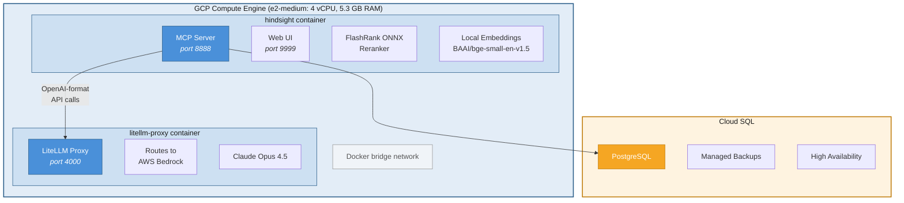
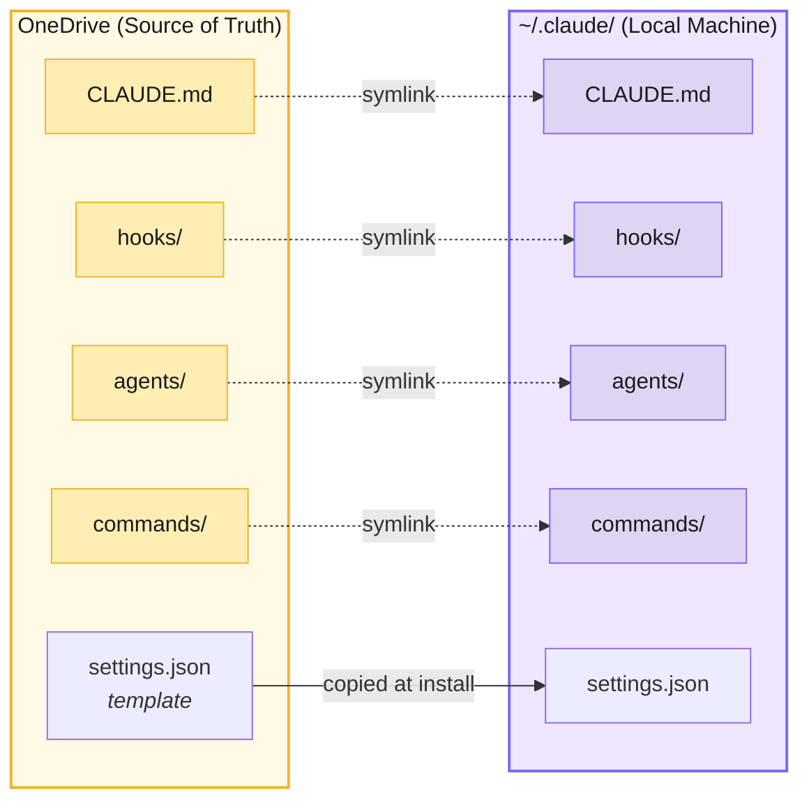
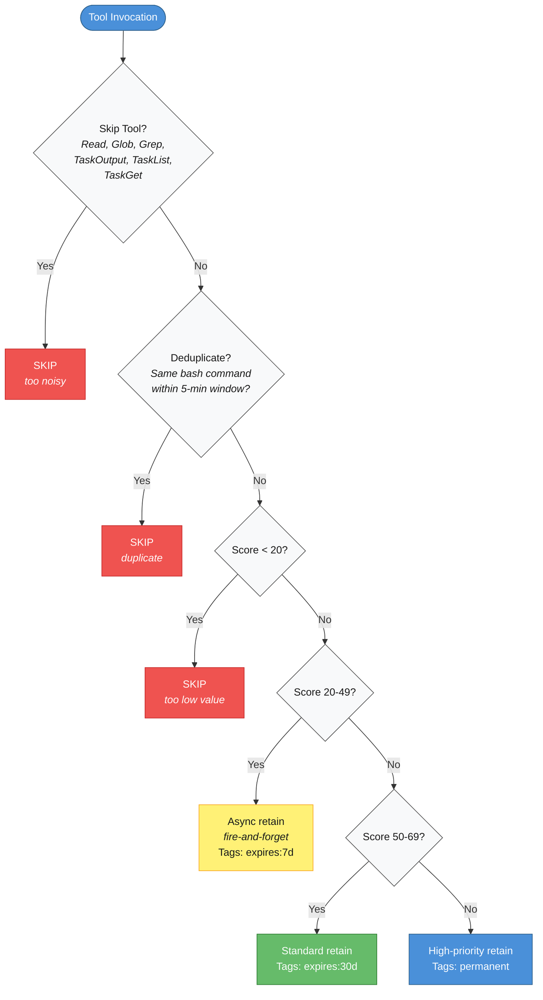

# Claude Code with Persistent Memory

<div align="center">
  <h3>Cross-Session, Cross-Machine Memory for Claude Code</h3>
  <p>
    <strong>7,000+ memories | 6.8x faster retrieval | 5 custom agents | Works everywhere</strong>
  </p>
  <p>
    <a href="#the-problem">Problem</a> &middot;
    <a href="#the-solution">Solution</a> &middot;
    <a href="#architecture">Architecture</a> &middot;
    <a href="#performance-benchmarks">Benchmarks</a> &middot;
    <a href="#quick-start">Quick Start</a> &middot;
    <a href="#documentation">Docs</a>
  </p>
</div>

---

## The Problem

**Claude Code forgets everything between sessions.**

Every time you start Claude Code, it's like meeting someone with amnesia. You have to:
- Re-explain your project architecture
- Repeat lessons learned from debugging
- Rediscover patterns that worked before
- Lose all context when switching machines

**Your knowledge compounds. Your AI should too.**

---

## The Solution

This repository implements **persistent, intelligent memory** for Claude Code using [Hindsight](https://github.com/vectorize-io/hindsight) by Vectorize.io, deployed as a production-grade cloud service:

- **Remembers across sessions** — Lessons learned yesterday are available today
- **Syncs across machines** — Laptop, desktop, and server share the same memory
- **Captures automatically** — No manual saving; importance scoring filters noise
- **Retrieves intelligently** — 6.8x faster reranking with FlashRank ONNX
- **Travels with you** — Custom agents, commands, and configurations follow everywhere

```
Before: "Claude, remember we're using AWS SSO for authentication"
After:  Claude already knows — auto-captured from your last session
```

For the full deployment story, see [HINDSIGHT-DEPLOYMENT-GUIDE.pdf](HINDSIGHT-DEPLOYMENT-GUIDE.pdf).

---

## Architecture

### GCP Deployment

Two Docker containers on a single GCP Compute Engine VM, backed by Cloud SQL PostgreSQL:



### Multi-Machine Sync

All Claude Code configuration syncs automatically via OneDrive symlinks:



OneDrive auto-detect libraries (PowerShell, Bash, Node.js) find the correct OneDrive path on both work and personal machines. Git serves as backup and version control; OneDrive handles real-time sync.

---

## Customizations vs Stock Hindsight

Starting from [stock Hindsight](https://github.com/vectorize-io/hindsight), this deployment replaces or upgrades every major component:

| Category | Stock Hindsight | This Deployment | Result |
|----------|----------------|-----------------|--------|
| **Database** | SQLite (local file) | Cloud SQL PostgreSQL | Durable, concurrent, survives container rebuilds |
| **LLM Provider** | Direct OpenAI | LiteLLM Proxy → AWS Bedrock | Claude Opus 4.5, SSO auth, org compliance |
| **Reranker Engine** | SentenceTransformers (PyTorch) | FlashRank (ONNX Runtime) | **6.8x faster** on CPU, 80% less RAM |
| **Reranker Model** | ms-marco-MiniLM-L-6-v2 (22 MB) | ms-marco-TinyBERT-L-2-v2 (4 MB) | Fastest available model |
| **Embeddings** | Configurable | Local BAAI/bge-small-en-v1.5 | No external API calls |
| **Reranker Loading** | Eager (on startup) | Lazy (`LAZY_RERANKER=true`) | Faster container startup |

---

## Performance Benchmarks

### Reranking Speed

| Metric | Before (SentenceTransformers) | After (FlashRank) | Improvement |
|--------|-------------------------------|-------------------|-------------|
| Reranking 300 candidates | 23.9s | 3.5s | **6.8x faster** |
| Total `recall()` latency | 24.3s | 5.7s | **4.2x faster** |
| `reflect()` (3 iterations) | ~78s | ~18s | **4.3x faster** |
| Cold start (first query) | N/A | 3.5s | One-time cost |

### Operational Metrics

| Metric | Value |
|--------|-------|
| Total memories stored | 7,273+ |
| Knowledge graph links | 738,808 |
| Named entities tracked | 8,066 |
| Average `recall()` (warm) | ~5.7s |
| Average `retain()` | ~200ms |
| Container memory usage | ~1.2 GB (both containers) |
| Uptime | 99.9%+ (GCP managed) |

---

## Auto-Capture System

A `PostToolUse` hook evaluates every Claude Code tool invocation and automatically stores valuable activities as memories. No manual intervention needed.

### Filtering Pipeline



### Importance Scoring

| Activity | Base Score | Modifiers |
|----------|------------|-----------|
| `git commit` | 90 | +15 if errors |
| `git push` | 85 | +15 if errors |
| File edit (.ts/.js/.py) | 65 | +10 if Write (new file) |
| `package.json` edit | 80 | Critical file boost |
| Command execution | 50 | -30 if trivial (ls, pwd, cd) |
| Task completion | 60 | +10 if subtasks |
| Error presence | +15 | Applied on top of base |

Memories are tagged with auto-generated metadata (`auto-captured`, `tool:bash`, `priority:high`, etc.) and expiry tags (`expires:7d`, `expires:30d`, `permanent`) for automatic lifecycle management. See [HINDSIGHT-SETUP.md](HINDSIGHT-SETUP.md) for full configuration details.

---

## Data Privacy

All embedding and reranking operations run locally on the GCP VM. Only LLM-dependent operations (`retain` for fact extraction and `reflect` for synthesis) send data to AWS Bedrock.

| Operation | Where It Runs | Data Leaves VM? |
|-----------|--------------|-----------------|
| **Embedding** | Local (BAAI/bge-small-en-v1.5) | No |
| **Reranking** | Local (FlashRank ONNX) | No |
| **Fact extraction** (retain) | AWS Bedrock via LiteLLM | Yes (to AWS) |
| **Synthesis** (reflect) | AWS Bedrock via LiteLLM | Yes (to AWS) |
| **Storage** | Cloud SQL PostgreSQL (same GCP project) | No |

AWS Bedrock does not use customer data for model training. No telemetry is sent to external services.

---

## Custom Agents and Commands

### 5 Specialized Agents

| Agent | Purpose | When It Activates |
|-------|---------|-------------------|
| **qa-test-engineer** | Comprehensive testing (unit through E2E) | After code changes, before merges |
| **requirements-guardian** | User acceptance testing | Verify features match specs |
| **devops-guardian** | Git operations, code review | Before commits, PRs, pushes |
| **elite-security-auditor** | Vulnerability scanning | Security-critical code |
| **elite-documentation-architect** | Technical writing | READMEs, APIs, architecture docs |

### Slash Commands

| Command | Description |
|---------|-------------|
| `/test` | Run comprehensive testing across all levels |
| `/worktree` | Manage git worktrees for parallel Claude sessions |

---

## MCP Tools

Hindsight exposes 5 core MCP tools to Claude Code:

| Tool | Purpose |
|------|---------|
| `retain` | Store a fact, decision, or insight |
| `recall` | Search stored memories using semantic similarity |
| `reflect` | Synthesize insights from multiple memories using LLM reasoning |
| `list_banks` | View all memory banks |
| `create_bank` | Create isolated memory namespaces |

**Example — recalling a past debugging session:**

```bash
# You: "How did we fix the AWS SSO issue last time?"
# Claude internally runs: reflect("AWS SSO debugging history")
# Returns: Detailed solution from 3 weeks ago, including code fixes
```

---

## Quick Start

### One-Click Installation

**Windows:**
```batch
:: Double-click from your OneDrive folder:
OneDrive\Claude Backup\claude-config\Install-Claude-Code.bat
```

**Mac/Linux:**
```bash
git clone https://github.com/PakAbhishek/claude-code-config.git
cd claude-code-config/_scripts
bash install-claude-complete.sh
```

### What Gets Installed

- Claude Code CLI (latest version)
- Hindsight MCP server connection
- AWS Bedrock via SSO (opens browser for auth)
- 5 custom agents + 2 slash commands
- Auto-capture hook (PostToolUse)
- SDLC enforcement hooks (security, protocols)
- Auto-sync symlinks (agents, commands, hooks, CLAUDE.md)
- AWS credential auto-push to GCP (SessionStart hook + Scheduled Task)

### Verify

```bash
claude --version                    # CLI installed
recall("test connection")           # Memory bank connected
ls ~/.claude/agents/                # 5 agent .md files
```

See [INSTALLER-README.md](INSTALLER-README.md) for detailed installation guide.

---

## Documentation

| Document | Description |
|----------|-------------|
| [HINDSIGHT-DEPLOYMENT-GUIDE.pdf](HINDSIGHT-DEPLOYMENT-GUIDE.pdf) | Full deployment architecture, benchmarks, and optimization details |
| [HINDSIGHT-SETUP.md](HINDSIGHT-SETUP.md) | Hindsight integration guide (hooks, scoring, usage examples) |
| [ARCHITECTURE.md](ARCHITECTURE.md) | System design and technical architecture |
| [SECURITY.md](SECURITY.md) | Security model and compliance |
| [INSTALLER-README.md](INSTALLER-README.md) | Installer technical documentation |
| [TROUBLESHOOTING.md](TROUBLESHOOTING.md) | Common issues and solutions |
| [CHANGELOG.md](CHANGELOG.md) | Version history |

---

## Repository Structure

```
claude-code-config/
  agents/                  # 5 custom agent definitions (.md)
  commands/                # Slash commands (/test, /worktree)
  hooks/                   # Auto-capture + SDLC enforcement hooks
  hindsight-setup/         # AWS credential pipeline scripts
  hindsight-mcp-server/    # Custom stdio MCP server (alternative)
  diagrams/                # Mermaid source files
  _scripts/                # Installers + cross-platform utilities
  HINDSIGHT-DEPLOYMENT-GUIDE.pdf
  README.md
```

---

## Author

**Abhishek Chauhan** &middot; [GitHub](https://github.com/PakAbhishek)

**Resources:** [Hindsight](https://github.com/vectorize-io/hindsight) &middot; [MCP Specification](https://spec.modelcontextprotocol.io) &middot; [Claude Code](https://claude.ai/claude-code)

---

<div align="center">
  <sub>7,273 memories &middot; 738,808 connections &middot; Growing every session</sub>
</div>
