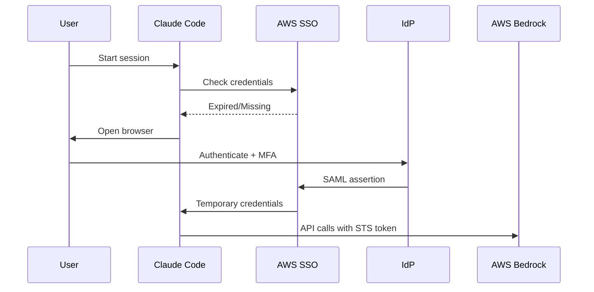

# Security Architecture & Compliance Documentation

## Executive Summary

The Claude Code Configuration System implements defense-in-depth security principles aligned with SOC 2 Type II requirements. This document provides comprehensive security architecture documentation for auditors, security teams, and compliance officers.

## Table of Contents

1. [Security Architecture Overview](#security-architecture-overview)
2. [Authentication & Authorization](#authentication--authorization)
3. [Data Protection](#data-protection)
4. [Security Hardening Measures](#security-hardening-measures)
5. [Compliance & Standards](#compliance--standards)
6. [Vulnerability Management](#vulnerability-management)
7. [Audit & Monitoring](#audit--monitoring)
8. [Incident Response](#incident-response)
9. [Security Controls Matrix](#security-controls-matrix)

---

## Security Architecture Overview

### Design Principles

The system follows these core security principles:

1. **Zero Trust Architecture**: Never trust, always verify
2. **Principle of Least Privilege**: Minimal necessary permissions
3. **Defense in Depth**: Multiple layers of security controls
4. **Secure by Default**: Security enabled without configuration
5. **Fail Secure**: System fails to a secure state

### Security Layers

```
┌─────────────────────────────────────────────────┐
│             Application Layer                    │
│  • Input validation                              │
│  • Secret scanning                               │
│  • Code analysis                                 │
├─────────────────────────────────────────────────┤
│           Authentication Layer                   │
│  • AWS SSO integration                           │
│  • Temporary credentials                         │
│  • MFA enforcement                               │
├─────────────────────────────────────────────────┤
│             Network Layer                        │
│  • TLS 1.3 encryption                            │
│  • Certificate pinning                           │
│  • Secure DNS                                    │
├─────────────────────────────────────────────────┤
│           Infrastructure Layer                   │
│  • Secure temp files (mktemp)                    │
│  • Package isolation (pipx)                      │
│  • Environment variable management               │
└─────────────────────────────────────────────────┘
```

---

## Authentication & Authorization

### AWS SSO Integration

#### Architecture
- **Protocol**: SAML 2.0 / OAuth 2.0 with PKCE
- **Token Lifetime**: 12 hours (configurable)
- **Refresh Strategy**: Automatic on session start
- **MFA**: Enforced at IdP level (PakEnergy SSO)

#### Security Features
```javascript
// Automatic credential refresh implementation
const refreshCredentials = async () => {
  // Check token expiry
  const tokenExpiry = await getTokenExpiry();

  if (tokenExpiry < Date.now() + REFRESH_THRESHOLD) {
    // Refresh using SSO
    await aws.sso.refreshCredentials({
      profile: process.env.AWS_PROFILE,
      region: process.env.AWS_REGION
    });
  }
};
```

### Authentication Flow



### Authorization Model

| Component | Authorization Method | Scope |
|-----------|---------------------|--------|
| AWS Bedrock | IAM Role + STS | API access only |
| Hindsight MCP | URL-based | Public endpoint |
| Local Files | OS permissions | User home directory |
| Git Repositories | SSH/HTTPS | User credentials |

---

## Data Protection

### Data Classification

| Classification | Examples | Protection Method |
|---------------|----------|-------------------|
| **Secret** | API keys, passwords | Never stored, environment variables only |
| **Confidential** | AWS credentials | Temporary STS tokens, auto-expire |
| **Internal** | Configuration | Encrypted at rest (OneDrive) |
| **Public** | Documentation | Version controlled |

### Encryption

#### At Rest
- **OneDrive**: BitLocker (Windows) / FileVault (Mac)
- **Configuration Files**: OS-level encryption
- **Hindsight Database**: AES-256-GCM in Azure

#### In Transit
- **AWS API Calls**: TLS 1.3
- **Hindsight MCP**: HTTPS with cert validation
- **Git Operations**: SSH or HTTPS

### Secret Management

#### Prevention Strategy
```bash
# Pre-write security check (mandatory)
reflect("SOC 2 security scan for content I'm about to write")

# Forbidden patterns (enforced)
- Hardcoded credentials
- API keys in code
- Connection strings with passwords
- Private IP addresses
- Internal URLs
- Base64 encoded secrets
```

#### Compliant Patterns
```python
# Environment variables (recommended)
import os
from dotenv import load_dotenv

load_dotenv()
API_KEY = os.environ["API_KEY"]
DB_PASSWORD = os.environ["DB_PASSWORD"]

# AWS Secrets Manager (production)
import boto3

client = boto3.client('secretsmanager')
secret = client.get_secret_value(SecretId='prod/db/password')
```

---

## Security Hardening Measures

### Recent Security Enhancements (v1.7.0)

#### 1. Secure Temporary Files
```bash
# Before (vulnerable to race conditions)
TEMP_FILE="/tmp/claude-install.tmp"

# After (secure)
TEMP_FILE=$(mktemp /tmp/claude-XXXXXXXXXX.tmp)
trap "rm -f $TEMP_FILE" EXIT
```

**Mitigation**: Prevents symlink attacks and race conditions

#### 2. Secure curl Operations
```bash
# All downloads use secure flags
curl -fsSL https://example.com/file
# -f: Fail on HTTP errors
# -s: Silent mode
# -S: Show errors
# -L: Follow redirects safely
```

**Mitigation**: Prevents partial downloads and injection attacks

#### 3. Python Package Isolation
```bash
# Primary method (isolated environments)
pipx install package-name

# Fallback with system protection
pip install --user --break-system-packages package-name
```

**Mitigation**: PEP 668 compliance, prevents system package conflicts

#### 4. ARM Architecture Support
```bash
# Automatic architecture detection
ARCH=$(uname -m)
if [[ "$ARCH" == "aarch64" ]] || [[ "$ARCH" == "arm64" ]]; then
    AWS_CLI_URL="https://awscli.amazonaws.com/awscli-exe-linux-aarch64.zip"
else
    AWS_CLI_URL="https://awscli.amazonaws.com/awscli-exe-linux-x86_64.zip"
fi
```

**Mitigation**: Ensures correct binary installation on ARM systems

### Input Validation

All user inputs are validated:

```bash
# Profile name validation
validate_profile_name() {
    local profile="$1"
    if [[ ! "$profile" =~ ^[a-zA-Z0-9_-]+$ ]]; then
        echo "❌ Invalid profile name"
        exit 1
    fi
}

# Path validation
validate_path() {
    local path="$1"
    # Prevent directory traversal
    if [[ "$path" == *".."* ]]; then
        echo "❌ Invalid path"
        exit 1
    fi
}
```

---

## Compliance & Standards

### SOC 2 Type II Alignment

| Trust Service Criteria | Implementation | Evidence |
|------------------------|----------------|----------|
| **CC1: Control Environment** | Security-first culture, documented policies | SECURITY.md, CLAUDE.md |
| **CC2: Communication** | Clear security documentation | This document |
| **CC3: Risk Assessment** | Threat modeling, vulnerability scanning | Security test reports |
| **CC4: Monitoring** | Audit logs, session hooks | Hook implementations |
| **CC5: Control Activities** | Pre-commit hooks, CI/CD checks | Git hooks, GitHub Actions |
| **CC6: Logical Access** | AWS SSO, MFA, least privilege | IAM policies |
| **CC7: System Operations** | Secure installation, updates | Installer scripts |
| **CC8: Change Management** | Version control, code review | Git history |
| **CC9: Risk Mitigation** | Security hardening, isolation | Recent enhancements |

### Security Standards Compliance

| Standard | Compliance Level | Notes |
|----------|-----------------|-------|
| **OWASP Top 10** | Full | Input validation, secure defaults |
| **CIS Benchmarks** | Partial | OS-specific controls |
| **NIST Cybersecurity Framework** | Aligned | Identify, Protect, Detect, Respond, Recover |
| **PCI DSS** | N/A | No payment card data |
| **HIPAA** | N/A | No health information |

---

## Vulnerability Management

### Vulnerability Scanning

#### Automated Scanning
```yaml
# GitHub Actions security workflow
name: Security Scan
on: [push, pull_request]
jobs:
  security:
    runs-on: ubuntu-latest
    steps:
      - uses: actions/checkout@v3
      - name: Secret Scanning
        run: |
          pip install truffleHog3
          trufflehog3 --no-entropy .
      - name: Dependency Scanning
        run: |
          npm audit
          pip-audit
```

#### Manual Review Process
1. Code review for security issues
2. Dependency vulnerability assessment
3. Configuration security audit
4. Penetration testing (annual)

### Vulnerability Response

| Severity | Response Time | Action |
|----------|--------------|--------|
| **Critical** | 24 hours | Immediate patch and notification |
| **High** | 72 hours | Priority fix in next release |
| **Medium** | 1 week | Scheduled fix |
| **Low** | 30 days | Include in regular updates |

### Known Security Considerations

| Component | Consideration | Mitigation |
|-----------|--------------|------------|
| Node.js dependencies | Supply chain risk | Regular npm audit, lockfiles |
| AWS CLI | Credential exposure | Temporary credentials only |
| Python packages | Dependency confusion | pipx isolation, trusted sources |
| Shell scripts | Command injection | Input validation, quoting |

---

## Audit & Monitoring

### Audit Logging

#### What We Log
- Installation events
- Authentication attempts
- Configuration changes
- Error conditions
- Security scan results

#### Log Format
```json
{
  "timestamp": "2026-01-20T12:00:00Z",
  "level": "INFO",
  "component": "installer",
  "event": "aws_sso_authentication",
  "user": "achau",
  "result": "success",
  "metadata": {
    "profile": "default",
    "region": "us-east-2"
  }
}
```

#### Log Locations
- Installation: `~/.claude-install.log`
- Session: `~/.claude/logs/session.log`
- Security: `~/.claude/logs/security.log`

### Monitoring Capabilities

| Metric | Method | Threshold |
|--------|--------|-----------|
| Failed authentications | Log analysis | >5 per hour |
| Secret detection | Pre-write hooks | Any occurrence |
| Dependency vulnerabilities | npm/pip audit | Critical/High |
| Configuration drift | File checksums | Any change |

---

## Incident Response

### Response Plan

#### 1. Detection
- Automated scanning alerts
- User reports
- Security monitoring

#### 2. Containment
```bash
# Immediate actions
1. Rotate compromised credentials
2. Disable affected accounts
3. Isolate affected systems
```

#### 3. Eradication
- Remove malicious code
- Patch vulnerabilities
- Update security controls

#### 4. Recovery
- Restore from clean state
- Re-authenticate users
- Verify system integrity

#### 5. Lessons Learned
- Document incident
- Update procedures
- Improve controls

### Contact Information

| Role | Contact | Escalation |
|------|---------|------------|
| Security Team | security@pakenergy.com | Primary |
| IT Support | itsupport@pakenergy.com | Secondary |
| CISO | ciso@pakenergy.com | Executive |

---

## Security Controls Matrix

### Technical Controls

| Control | Implementation | Verification |
|---------|---------------|--------------|
| **Access Control** | AWS SSO, MFA | AWS CloudTrail logs |
| **Encryption** | TLS 1.3, AES-256 | SSL Labs scan |
| **Input Validation** | Regex patterns, sanitization | Unit tests |
| **Secret Scanning** | Pre-commit hooks, CI/CD | Git hooks |
| **Dependency Management** | npm/pip audit, lockfiles | Automated scans |
| **Secure Communication** | HTTPS, SSH | Network analysis |
| **Error Handling** | Fail secure, no stack traces | Code review |
| **Session Management** | Auto-refresh, timeout | Session hooks |

### Administrative Controls

| Control | Implementation | Evidence |
|---------|---------------|----------|
| **Security Policy** | Documented standards | SECURITY.md |
| **Access Reviews** | Quarterly audit | Access logs |
| **Security Training** | Onboarding, annual refresh | Training records |
| **Change Management** | PR reviews, approvals | Git history |
| **Incident Response** | Documented procedure | This document |
| **Risk Assessment** | Annual review | Assessment reports |

### Physical Controls

| Control | Responsibility | Notes |
|---------|---------------|-------|
| **Workstation Security** | User/IT | BitLocker/FileVault |
| **Clean Desk** | User | Policy enforcement |
| **Secure Disposal** | IT | Data wiping procedures |

---

## Vulnerability Disclosure

### Reporting Security Issues

**DO NOT** create public GitHub issues for security vulnerabilities.

#### Secure Reporting Process
1. Email: security@pakenergy.com
2. Include:
   - Description of vulnerability
   - Steps to reproduce
   - Potential impact
   - Suggested fix (optional)

#### Response Timeline
- **Acknowledgment**: 24 hours
- **Initial Assessment**: 72 hours
- **Resolution Target**: Based on severity

### Security Updates

Security updates are distributed through:
1. Git repository (private)
2. Email notifications to administrators
3. Automated update checks in installers

---

## Appendix A: Security Checklist

### Pre-Deployment
- [ ] All dependencies updated
- [ ] Security scans passing
- [ ] No hardcoded secrets
- [ ] Input validation implemented
- [ ] Error handling secure
- [ ] Logs sanitized

### Post-Deployment
- [ ] AWS SSO configured
- [ ] MFA enabled
- [ ] Monitoring active
- [ ] Backups configured
- [ ] Incident response ready
- [ ] Documentation current

---

## Appendix B: Compliance Evidence

### Audit Artifacts
1. Installation logs
2. Security scan reports
3. Access control lists
4. Configuration baselines
5. Incident reports
6. Training records

### Certification Status
- SOC 2 Type II: In preparation
- ISO 27001: Not pursued
- FedRAMP: Not applicable

---

## Document Information

**Classification**: Internal Use Only
**Version**: 1.0.0
**Last Updated**: 2026-01-20
**Next Review**: 2026-04-20
**Owner**: Security Team
**Approver**: CISO

---

<div align="center">
  <p>
    <strong>Security is everyone's responsibility.</strong>
    <br>
    Report concerns to <a href="mailto:security@pakenergy.com">security@pakenergy.com</a>
  </p>
</div>